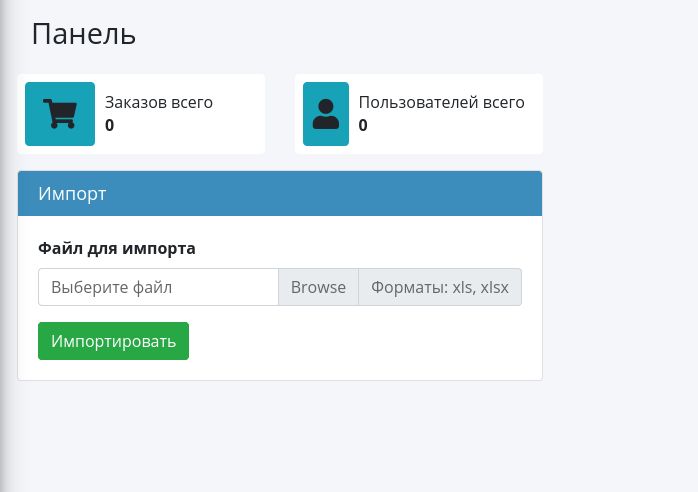
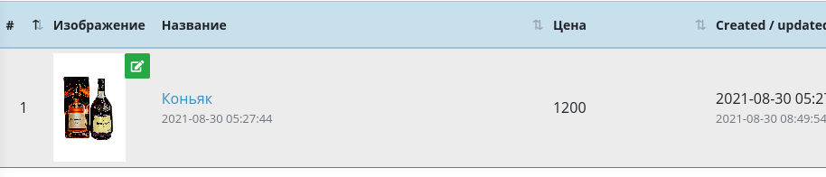
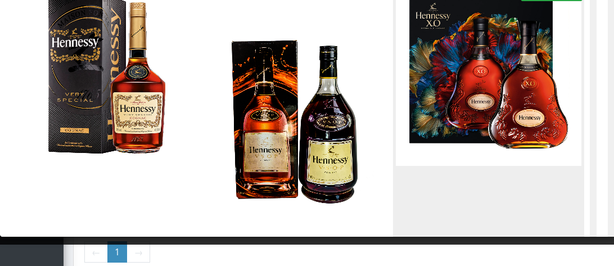

# Alcobot

## Бот-алкомагазин
Данный бот имеет функционал магазина. Сохраняет заказы, пользователей. меется возможность редактирования товаров и категорий.

Используемые стек технологий:
* PHP 7.4 и выше
* Laravel framework 8.0
* СУБД Mysql
* Telegram bot api
* Опционально использование Cron для получения сообщений из бота для последующей обработки.

По умолчанию код хранится без packagist пакетов из папки *vendor*. Выполнить установку можно выполнив в консоли в папке проекта
```sh
$ composer install
```

По умолчанию данные для авторизации: 
admin@example.com
1234567890

### Dashboard


Главная страница для пользователя по умолчанию. Находится по адресу */admin*. На данной странице имеется аналитика и форма для импорта товаров. Пример файла иморта находится в *storage/app/muster.xlsx*. Если не менять наименование товара, то при импорте просто обновится цена.

**При изменении файла импорта важно не менять порядок колонок и не убирать первую строку!**

### Номенклатура
Магазин в данном приложении имеет разделы - категории. Их можно редактировать в */admin/categories*. Разделы имеют иерарзическую структуру. Товары находятся в категориях. На странице товаров есть возможность искать в поисковой системе по названию товара релевантную картинку. Окно диалога с поиском можно вызвать по клику на кнопку редактирования справа от существуюещег изображения товара.


В открывшемся окне поиска необходимо выбрать наиболее подходящую картинку кликом по зеленой кнопке.


В крайней правой колонке расположены кнопки редактирования и удаления товаров.

### Заказы
В отличии от товаров, заказы - нередактируемая сущность. Но справа у заказа есть кнопка просмотра. Содержимое заказа откроется в модальном окне.

### Настройки
По адресу *admin/env/editor* находится редактор настроек, так называемый **ENV-редактор**. Изменение настроек необходимо делать с умом, так как последствия могут быть необратимыми.

Ключевые настройки для бота:
* TG_BOT_API_KEY - секретный ключ бота, получаемый в @BotFather при создании бота. Может быть изменен. Важно беречь, так как с этим ключем можно читать все сообщения бота.
* TG_BOT_USERNAME - имя бота. Опционально!
* TG_MANAGER_ID - список менеджеров, которым приходит уведомление о заказе. Можно ставить через запятую, если больше 1. Например 1, 2. Получить ID можно переслав сообщение пользователя боту @userinfobot.
* BING_HOST - хост поисковой системы бинг для поиска по изображениям.
* BING_KEY - секретный ключ для поисковой системы
* BING_URL - урл запроса. По умолчанию https://bing-image-search1.p.rapidapi.com/images/search

### Пользователи
Список пользователей системы.

### Страницы
Информационные страницы. Для изменения контента необходимо использовать разметку markdown.
